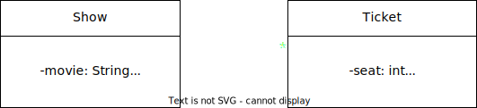

# Show and ticket

In the class diagram below, the classes Show and Ticket and their connection are depicted. The star is at the Ticket end of the connection — in this case the star gives some extra information of the connection; even though a show doesn't know about the tickets that have been sold to it, you can still sell many tickets to one show.

Implement the classes in the diagram in the exercise base.

